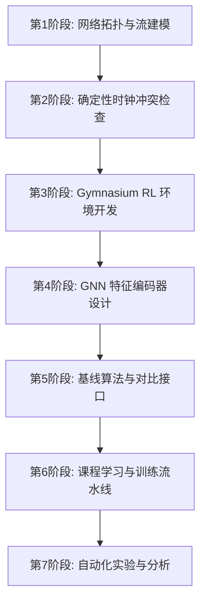
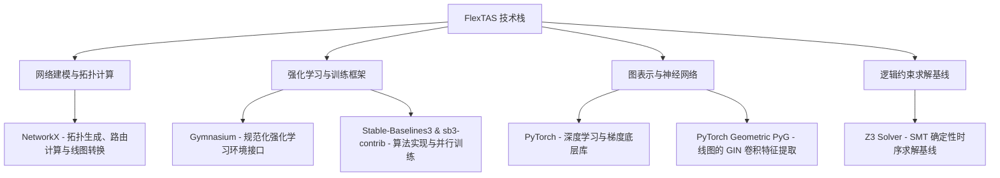

# FlexTAS 项目分析与技术问答

本文件汇集了关于 **FlexTAS**（基于深度强化学习的 TSN 柔性门控调度算法）项目的结构分析、开发流程、技术栈架构以及强化学习 MDP 映射的详细解答。

---

## 目录
1. [一、 FlexTAS 项目结构分析](#一-flextas-项目结构分析)
2. [二、 从零开始的系统化开发流程](#二-从零开始的系统化开发流程)
3. [三、 深入项目架构与技术栈设计](#三-深入项目架构与技术栈设计)
4. [四、 环境与智能体决策层 (RL Env & Agent) 深度拆解](#四-环境与智能体决策层-rl-env--agent-深度拆解)
5. [五、 马尔可夫决策过程 (MDP) 在代码中的具体映射](#五-马尔可夫决策过程-mdp-在代码中的具体映射)

---

## 一、 FlexTAS 项目结构分析

FlexTAS 是一个典型的结合了**图神经网络 (GNN)** 与 **强化学习 (DRL)** 的确定性网络调度项目。其目录结构职责划分非常清晰：

```text
FlexTAS-DrlGeneral/
├── conda_env*.yml          # Conda 运行环境配置文件（分为 macOS/CPU/CUDA 显卡版本）
├── definitions.py          # 全局路径常量定义（ROOT_DIR, OUT_DIR, LOG_DIR 等）
├── run_model.py            # 模型测试/运行脚本
├── README.md & summary.md  # 详细说明文档与核心架构概述
├── app/                    # 启动与入口脚本层
│   ├── train.py            # DRL 训练入口，包含课程学习逻辑和训练曲线绘制
│   ├── test.py             # 训练模型的单次测试/验证入口
│   └── plot_training.py    # 训练曲线可视化
├── src/                    # 核心源码层
│   ├── agent/              # DRL Agent 编码器
│   │   └── encoder.py      # FeaturesExtractor 特征提取器（基于 GIN 和 MLP 的混合网络）
│   ├── env/                # Gymnasium 强化学习环境
│   │   └── env.py          # 包含核心 NetEnv、支持课程学习的 TrainingNetEnv 及状态编码器 _StateEncoder
│   ├── app/                # 调度实现与基线对比
│   │   ├── scheduler.py    # Scheduler 基类及调度结果分析器（ResAnalyzer）
│   │   ├── drl_scheduler.py# 基于 DRL 模型的调度器封装（MaskablePPO 决策）
│   │   ├── no_wait_tabu_scheduler.py # Tabu Search 禁忌搜索基线调度器
│   │   ├── Oliver2018_scheduler.py   # Oliver2018 经典 SMT 求解基线（基于 Z3 约束求解器）
│   │   └── evaluation.py             # 评估框架（用于多调度器对比的大规模对比实验）
│   ├── network/            # 网络拓扑与元素模型
│   │   └── net.py          # Flow(流)、Link(链路)、Network(网络拓扑)模型及拓扑生成逻辑
│   └── lib/                # 工具与基础架构支撑层
│       ├── config.py       # Config 配置文件读取
│       ├── execute.py      # 命令行参数自动解析
│       ├── graph.py        # 网络拓扑图的邻居查找计算
│       ├── operation.py    # Operation 数据类与隔离约束冲突检测算法
│       └── log_config.py   # 统一的日志格式配置
├── model/                  # 存放训练好的 DRL 模型压缩包 (.zip)
└── out/                    # 运行输出目录（包含日志 log/、监控数据 monitor/ 和实验结果 data/）
```

---

## 二、 从零开始的系统化开发流程

若要从零构建本项目，通常遵循自底向上（Bottom-Up）的系统化开发流水线：



### 1. 第一阶段：网络拓扑与流模型建模（构筑基石）
- **物理抽象**：在 `src/network/net.py` 中建立 `Link`（链路）和 `Flow`（数据流）数据类。
- **拓扑生成**：利用 `networkx` 构建物理拓扑生成算法，提供对 RRG、BAG、ERG 以及车载网络 CEV 拓扑的支持。

### 2. 第二阶段：确定性时钟时序与冲突检查（约束规则）
- **时域封装**：定义 `Operation` 数据结构，表达流在物理链路上的传输时段。
- **冲突判断**：编写基于最大公约数（GCD）与最小公倍数（LCM）的冲突判定机制，确保链路上的流时序完全隔离。

### 3. 第三阶段：Gymnasium 强化学习环境封装（构建交互）
- **动作定义**：定义离散动作空间 `spaces.Discrete(2)`（`0` 代表普通排队等待，`1` 代表启用 GCL 门控）。
- **观测提取**：在 `NetEnv` 中实现 `_StateEncoder`，收集多维度状态（包含流特征、链路特征和周围邻居拓扑特征）。
- **状态推演**：编写 `step()` 函数，在接收动作后物理推导时序平移退避，直至无冲突；判定抖动超限并合理计算 Reward。

### 4. 第四阶段：基于 GNN 的特征编码器（空间感知力）
- **网络设计**：在 `src/agent/encoder.py` 中构建图同构网络 `GinModel`（基于 `torch_geometric.nn.GINConv`），把邻居链路图压缩为拓扑特征嵌入。
- **特征拼接**：编写 `FeaturesExtractor`，将图提取特征与 MLP 提取的非结构化流/路径特征级联，产出 192 维联合特征。

### 5. 第五阶段：基线调度器与评估接口开发（对比验证）
- **基类规范**：定义 `BaseScheduler` 基类，规范化统一调度接口。
- **基线实现**：编写 Tabu Search 禁忌搜索基线调度算法与 Z3 SMT 约束求解基线。

### 6. 第六阶段：课程学习与训练流水线（智能体进化）
- **课程过渡**：引入 `TrainingNetEnv`，初始只调度 20% 数量的流，智能体通关一定次数后逐步增加流数，实现难度平滑过渡。
- **训练整合**：编写 `app/train.py`，使用多进程 `SubprocVecEnv` 并行推演，调用带动作掩码的 `MaskablePPO` 算法完成模型训练。

### 7. 第七阶段：系统评估与鲁棒性验证（实验产出）
- **批量实验**：编写 `src/app/evaluation.py` 对各算法进行大规模横向对比，输出 Schedulability 和耗时，导出 CSV 图表。

---

## 三、 深入项目架构与技术栈设计

### 1. 核心技术栈选型



### 2. 三路特征拼接网络设计

智能体通过将图拓扑空间结构与单流物理特性相结合，实现卓越的泛化表现：

```
                      ┌──────────────────────┐
 flow_feature  ──────>│  MLP (Linear + ReLU) ├──────────┐
 link_feature  ──────>│                      │          │
                      └──────────────────────┘          ▼
                      ┌──────────────────────┐   ┌─────────────┐   ┌───────────────┐
 adjacency_matrix ───>│  GINConv × 2 + BN    ├──>│   Concat    ├──>│  MaskablePPO  │
 features_matrix ────>│  + GlobalMeanPool    │   │ (192 维向量) │   │    Policy     │
                      └──────────────────────┘   └─────────────┘   └───────────────┘
                      ┌──────────────────────┐          ▲
 remain_hops  ───────>│  MLP (Linear + ReLU) ├──────────┘
                      └──────────────────────┘
```

---

## 四、 环境与智能体决策层 (RL Env & Agent) 深度拆解

### 1. `NetEnv.step(action)` 的时空演化与物理仿真
当 Agent 选择动作后，`NetEnv` 物理推演过程如下：
1. **时间视窗计算**：若 `gating=1`，`wait_time = 0` 且在链路中记录占用 GCL 开销。若 `gating=0`，在当前链路上注入干扰延迟 `wait_time = link.interference_time()`。
2. **冲突推演平移（关键碰撞规避）**：计算该跳的临时 Operation。若该 Operation 与该链路上已有的其他流时序重合，则通过 `_check_temp_operations` 计算重合量 `offset`。将本条流在该跳及之前所有确定好的 Operation **统一往后平移 `offset` 微秒**，重复验证，直至完全时空隔离。
3. **约束终检**：若平移导致该流总时间超过了其周期，或在最后一跳累积抖动超过了流的 Jitter 限制，则引发 `SchedulingError` 终止 Episode，判定调度失败并扣减 Reward。

### 2. 局部两跳拓扑的 GNN 卷积编码
`src/agent/encoder.py` 内部的 `GinModel` 利用 GIN 卷积层提取当前链路两跳邻域内（通过 Line Graph 转化）的拓扑流量与拥堵状态：

```python
class GinModel(nn.Module):
    def __init__(self, num_features, dim1=32, dim2=64, embed_dim=64):
        super(GinModel, self).__init__()
        nn1 = Sequential(Linear(num_features, dim1), ReLU(), Linear(dim1, dim2))
        self.conv1 = GINConv(nn1)  # 图同构卷积 1
        self.bn1 = nn.BatchNorm1d(dim2)
        nn2 = Sequential(Linear(dim2, dim2), ReLU(), Linear(dim2, embed_dim))
        self.conv2 = GINConv(nn2)  # 图同构卷积 2
        self.bn2 = nn.BatchNorm1d(embed_dim)

    def forward(self, data):
        x, edge_index, batch = data.x, data.edge_index, data.batch
        # ... 剔除 Padding 负数无效边
        x = F.relu(self.conv1(x, edge_index))
        x = self.bn1(x)
        x = F.relu(self.conv2(x, edge_index))  # 扩大感受野到 2 阶邻居
        x = self.bn2(x)
        x = global_mean_pool(x, batch)  # 全局均值池化，输出 64 维链路拥堵图嵌入
        return x
```

---

## 五、 马尔可夫决策过程 (MDP) 在代码中的具体映射

在 FlexTAS 中，决策时序严格按照数学 MDP 模型 $\langle S, A, P, R, \gamma \rangle$ 运行：

| MDP 数学元素 | 在 FlexTAS 项目中的具象化代码映射与设计 |
| :--- | :--- |
| **状态空间 $S$ (State)** | 由 `_StateEncoder.state()` 返回的联合字典构成。包含当前流的静态属性与当前跳、当前物理链路的硬件负荷特征、局部两跳的拓扑图结构与特征特征、以及未来待选路径的链路级联特征。 |
| **动作空间 $A$ (Action)** | `spaces.Discrete(2)`。动作 `0` 表示不加门控（使用常规ST排队并产生抖动），动作 `1` 表示启用 GCL 门控（时延归零但增加硬件存储开销）。通过 `action_masks()` 实现动作过滤，提前屏蔽溢出和直接出局的无效动作。 |
| **状态转移 $P(s' \mid s, a)$** | 在 `step(action)` 中执行。系统根据 Action 进行物理时序窗计算与碰撞平移消解。平移和分配完毕后，若流走到终点，推进 `self.flow_index += 1` 指向下一流，否则推进当前流在路径上的 Hop 指针。调用 `_generate_state()` 渲染出下一时刻的结构化状态 $s_{t+1}$。 |
| **奖励函数 $R(s, a)$ (Reward)** | 复合优化目标。公式设计为：$\text{Reward} = 1 + R_{gcl} + R_{time}$。其中 $R_{gcl}$ 以负值惩罚门控硬件占用，$R_{time}$ 以负值惩罚出队排队等待时间。此外，通过平方级里程碑奖励鼓励智能体调度尽量多的流成功通关。 |
| **折扣因子 $\gamma$ (Discount)** | 在实例化 `MaskablePPO` 策略模型时配置（默认 `0.99`）。高折扣因子强迫 Agent 在进行前几跳决策时，便着眼于整条物理路径后续几跳在宏观时间轴上的碰撞与抖动影响，防止近视决策。 |

---
*FlexTAS: Flexible Gating Control for Enhanced Time-Sensitive Networking Deployment (TII 2025)*
